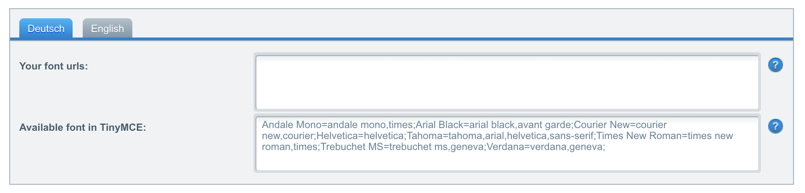

## SwagTinyMceCustomFont

* **Plugin version:** 1.0.0
* **License**: MIT license (see [LICENSE](LICENSE) file in the repository)
* **Support:** No official support, use the [community forum](https://forum.shopware.com/)
* **Minimum Shopware version:** [Shopware 5.2.21](http://community.shopware.com/Downloads_cat_448.html#5.2.21)
* **Plugin system:** Shopware 5.2 plugin system
* **Github Repository:** [https://github.com/shopwareLabs/SwagTinyMceCustomFont](https://github.com/shopwareLabs/SwagTinyMceCustomFont)

### Disclaimer
> The plugin was tested in [Shopware 5.3](http://en.community.shopware.com/Downloads_cat_448.html#5.3.0) using the fonts from [Google Fonts](https://fonts.google.com/).

### Description
The plugin provides you with the ability to register & add custom fonts for the WYSIWYG editor [TinyMCE](https://www.tinymce.com/). The editor is used throughout in almost very module in your Shopware administration interface. The plugin automatically imports the font urls in the administration for the preview of the custom font in the editor as well as in the store front of your Shopware shop. The font imports will be included in the compiled CSS file.

### Installation
The plugin uses the new plugin system we've introduced with Shopware 5.2. Therefore you have to install the plugin in the folder `custom/plugins` of your Shopware installation. Next head to the plugin manager and install the plugin.

### Configuration

*"SwagTinyMceCustomFont" plugin configuration*

* **Your font urls**
	* The plugin allows you to register one or more urls
	* Please add each URL line-by-line in the textarea
	* The plugin is designed to include a CSS file from a remote source ([Google Fonts](https://fonts.google.com/) for example)
* **Available font in TinyMCE**
	* This field provides you with the ability to customize the "font" drop down in the TinyMCE editor. To use a custom font in the editor, you have to extend the string in the textarea with your font.
	* The format is as following: `[name]=[font-family-name];`
	* For example, to use the font *"Roboto"* from [Google Fonts](https://fonts.google.com/), we have to extend the string in the textarea with the following: `Roboto='Roboto',sans-serif;`
	* Please make sure you're not using double quotes for the font name, otherwise the TinyMCE would not work correctly anymore.

### Example usage
1. Upload & install the plugin using the plugin manager
2. Go to [Google Fonts](https://fonts.google.com/)
3. Choose a font and click on the panel at the bottom right hand of the screen
4. Under the tab "Embed" click the "@import" link
5. Copy the URL (only the URL, leave out the "@import url()" part)
6. Head over to the plugin configuration and paste in the copied URL
7. Back to Google Fonts in the section "Specify in CSS" copy the CSS definition of the font (the part after "font-family")
8. Add the font name followed by an equal sign and paste in the copied CSS definition. The added string should look like this: `Roboto='Roboto',sans-serif;`
9. Save the plugin configuration, clear the cache, warm up the theme cache & reload the backend
 

## License
The MIT License (MIT). Please see [License File](LICENSE) for more information.